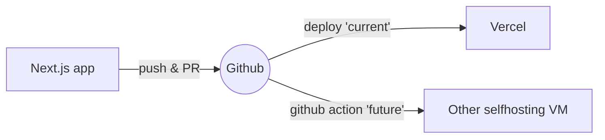
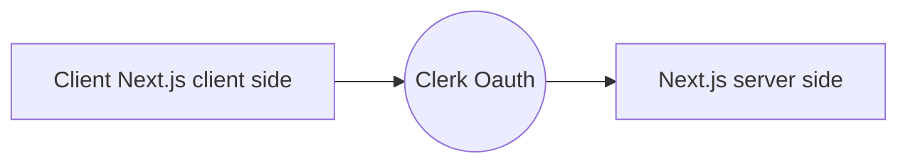
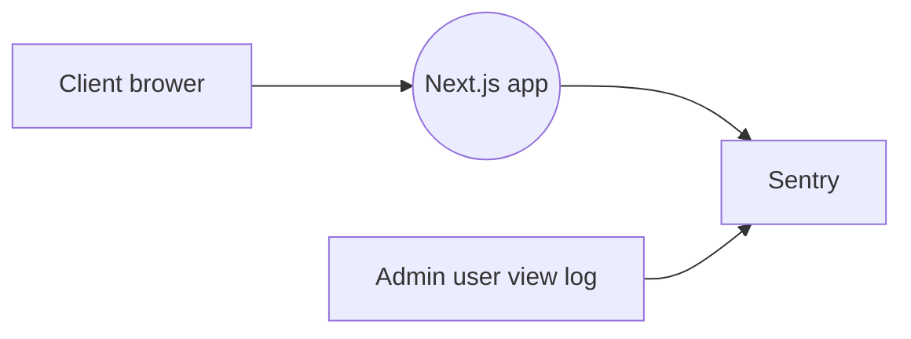
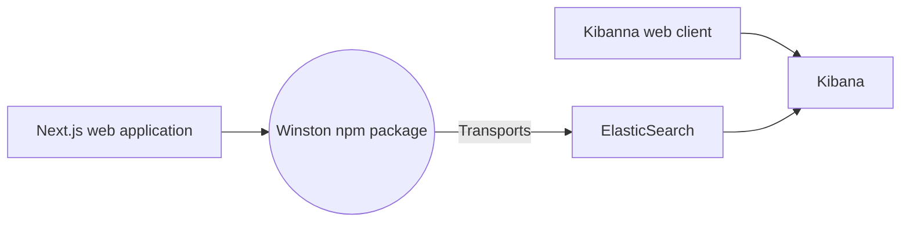
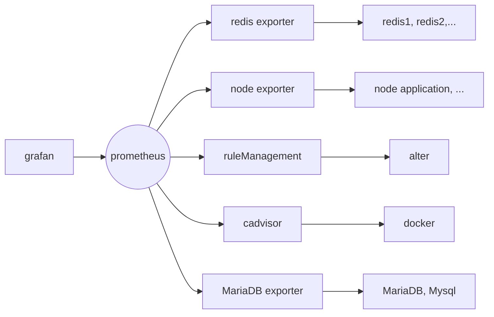

# BCWF 

## Description 

`bcwf-ts` is a software architecture tailored for Next.js version 13+ and above, utilizing the app directory structure. We've established four environments for this project:

1.  Local Workstation
2.  Docker Development
3.  Docker Staging
4.  Docker Production

You have the flexibility to deploy as per your requirements. However, we primarily recommend two deployment scenarios:

1.  For startups: Deploy to Vercel and integrate with Sentry for monitoring and logging services.
2.  Self-hosted deployment on virtual machines, such as DigitalOcean, AWS, Azure, etc.


## Getting Started

### Dependencies and Installing

1. running the project in your local Workstation
- install node 18.13.0 or above, but highly suggest running in 18.13.0 just for consistency.
- you can install pnpm or yarn, if you want. But in this project, we will are using npm by default.

2. Running in docker
- install docker to your local workstation, if you are going to run it locally.

3. IDE
- you can use whatever you want, but I am using vsCode for this project's development

4. System graph and 3rd party integration
- CI/CD for Startup development:

- Current workflow for Startup development:

- Startup development:
	- Application issue logging: 

- Selfhost development:
	- Application issue logging: 

- Software issue logging (redis, database, node application, etc. ):   



### Setting .env*
Please change `!!!please-change-this-file-to-env!!!` to the `.env.*` file you would like to use
1. `env.local` is for local development or development docker
2. `env.stg` is for staging docker
3. `env.prod` is for production docker


#### Developing the application in a local workstation, and a dev container
1. run in the local workstation
	```bash
	npm run dev
	```
2.  Dev container
	- Please read `Makefile`, if you are local workstation can run `Makefile` then please run `make docker-dev`, otherwise, please read the instruction inside [`Makefile`](Makefile)
	```bash
	make docker-dev
	```
#### Deploy on Vercel and logging service Sentry

##### *Vercel*
The easiest way to deploy your Next.js app is to use the [Vercel Platform](https://vercel.com/new?utm_medium=default-template&filter=next.js&utm_source=create-next-app&utm_campaign=create-next-app-readme) from the creators of Next.js.

Check out [Next.js deployment documentation](https://nextjs.org/docs/deployment) for more details.

##### *Sentry*
Sentry is a logging service for start-up development

How to setup Sentry [document](https://docs.sentry.io/platforms/javascript/guides/nextjs/)

##### *Clerk*
The clerk is an Oauth service provider for start-up development

How to setup Clerk [document](https://clerk.com/docs)

## License

[Apache 2.0](https://www.apache.org/licenses/LICENSE-2.0) License - see the [LICENSE.md](https://github.com/bcgov/wps/blob/main/LICENSE)

# #Todo
1. configuration for the vsCode IDE
2. give out samples for Jest and Cypress
3. how to setup instructions for self-host VM with ELK log service
